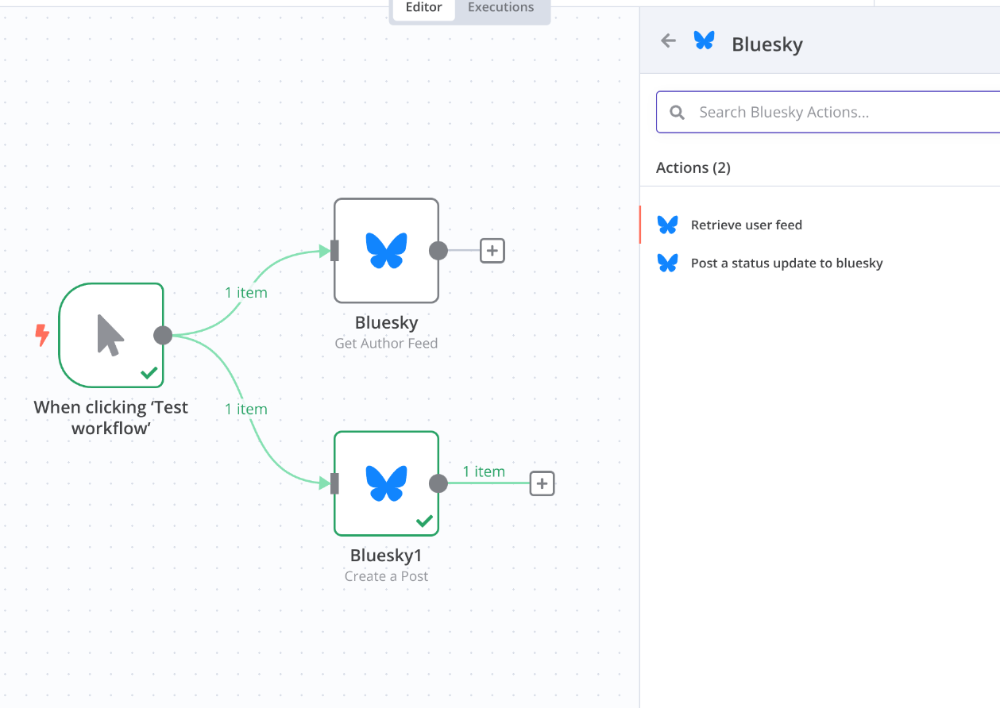

# n8n-nodes-bluesky

This repository contains the code for the n8n nodes that interact with the [Bluesky API](https://docs.bsky.app/docs/category/http-reference).

## Installation

```bash
pnpm install @muench-dev/n8n-nodes-bluesky
```

In n8n community edition, you can install the nodes in the settings page.

## Features

- User
	- Get Profile
  - Mute User
  - Un-mute User
  - Block User
- Feed
	- Get Author Feed
	- Get Timeline of current user
- Post
	- Create Post
  - Like
  - Unlike
  - Repost
  - Delete Repost

## Screenshots


