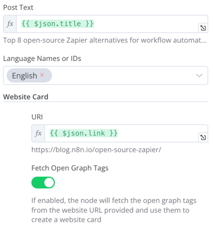

# n8n-nodes-bluesky

This repository contains the code for the n8n nodes that interact with the [Bluesky API](https://docs.bsky.app/docs/category/http-reference).

## Installation

```bash
pnpm install @muench-dev/n8n-nodes-bluesky
```

In n8n community edition, you can install the nodes in the settings page.

## Authentication

This node supports two methods of authentication: App Password and OAuth2 (Beta).

### OAuth2 Authentication (Beta/Experimental)

This method is being introduced in anticipation of Bluesky's official OAuth2 support. Its full functionality is dependent on Bluesky finalizing its OAuth2 implementation and providing a way for applications to register for Client IDs and Secrets.

**Steps to configure:**

1.  Create new credentials in n8n: Go to the "Credentials" section, click "Add credential", and search for/select "Bluesky OAuth2 API".
2.  **Client ID**: Enter the Client ID obtained from Bluesky for your n8n application. (Details pending Bluesky's official documentation for app registration).
3.  **Client Secret**: Enter the Client Secret obtained from Bluesky.
4.  **Authorization URL**: This is the URL where you will be redirected to authorize the application. It's currently pre-filled with a placeholder (`https://bsky.social/oauth/authorize`) and will be updated once Bluesky provides the official URL.
5.  **Access Token URL**: This is the URL from which n8n will fetch the access token. It's currently pre-filled with a placeholder (`https://bsky.social/oauth/token`) and will be updated once Bluesky provides the official URL.
6.  **Scope**: The default scopes requested are `read write profile feed`. These define the permissions your n8n workflow will have. These may be subject to change based on Bluesky's implementation.

**Note:** Full functionality of OAuth2 authentication is pending Bluesky's finalization of its OAuth2 endpoints and app registration process. The current setup uses placeholder URLs.

In the Bluesky node configuration within your n8n workflow, select "OAuth2" as the "Authentication Type" and choose your created "Bluesky OAuth2 API" credential.

### App Password Authentication (Legacy/Alternative)

This method uses your Bluesky handle and an App Password.

**Credential Fields:**

1.  Create new credentials in n8n: Go to the "Credentials" section, click "Add credential", and search for/select "Bluesky API".
2.  **Identifier (Handle)**: Your Bluesky handle (e.g., `yourname.bsky.social` or `your.customdomain.com`).
3.  **App Password**: Your Bluesky App Password. You can create one in your Bluesky account settings.
4.  **Service URL**: The URL of your AT Protocol service. Defaults to `https://bsky.social`.
    *   For most users, the default `https://bsky.social` will work.
    *   If you use a custom domain for your handle (e.g., `your.customdomain.com`) AND experience issues with the default Service URL (especially if your account is hosted on a PDS other than bsky.social), try providing the URL of your specific PDS (Personal Data Server) here (e.g., `https://pds.example.com`).
    *   The node attempts to resolve handles to their DIDs automatically, which should work in most cases even with custom domains using the default service URL. Providing the specific PDS URL is a fallback if resolution issues occur.

**Note:** This method remains available. For users with custom domains, the node now includes improved handle resolution to automatically find your account's DID.

In the Bluesky node configuration within your n8n workflow, select "App Password" as the "Authentication Type" and choose your created "Bluesky API" credential.

## Features

- User
	- Block User
	- Get Profile
	- Mute User
	- Un-mute User
	- Unblock User
- Feed
	- Get Author Feed
	- Get Timeline of current user
- Post
	- Create Post
	- Delete Post
	- Like Post
	- Delete Like
	- Repost
	- Delete Repost

## Screenshots


## Use Cases

### RSS Feed to Bluesky

You can use the RSS Trigger node to get the latest posts from an RSS feed and then use the Create Post node to post them to Bluesky.


Use Open Graph Tags to get the image and description of the post.



## Development

Follow the [n8n documentation for creating nodes](https://docs.n8n.io/integrations/creating-nodes/build/node-development-setup/).
