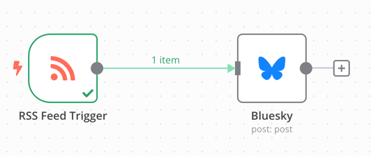
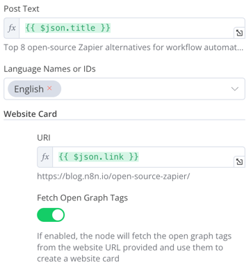
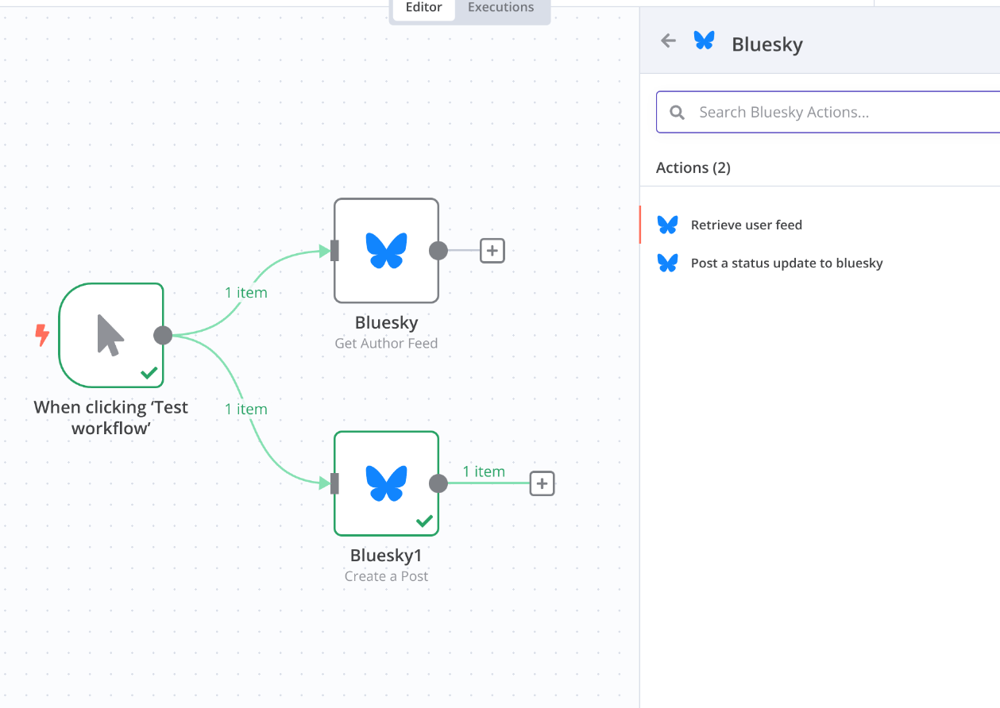

# n8n-nodes-bluesky

Community n8n nodes for interacting with the [Bluesky API](https://docs.bsky.app/docs/category/http-reference).

The package ships a versioned `Bluesky` node. Version 2 is the default and includes the latest features.

## Installation

Install the package in an n8n environment:

```bash
pnpm add @muench-dev/n8n-nodes-bluesky
```

You can also install it from the Community Nodes section in n8n.

## Requirements

- Node.js `>=18.10`
- pnpm `>=9.1`
- A Bluesky app password

Create an app password in Bluesky here:
`https://bsky.app/settings/app-passwords`

## Credentials

The node uses these credential fields:

- `Identifier (Handle)`
- `App Password`
- `Service URL` with `https://bsky.social` as the default

The custom service URL is useful when you want to authenticate against a different AT Protocol service.

## Features

### User

- Get Profile
- List All Followers
- List All Follows
- Mute User
- Un-Mute User
- Block User
- Un-Block User

### Feed

- Get Author Feed
- Get Post Thread
- Get Timeline

Feed also supports author feed filtering:

- Posts with Replies
- Posts without Replies
- Posts with Media
- Posts and Author Threads
- Posts with Video

Feed responses are normalized and include post metadata such as author details, counts, embeds, reply parent details, and repost context when available.

### Analytics

- List Notifications
- Get Unread Notification Count
- Update Seen Notifications
- Get Post Interactions

### Graph

- Mute Thread

### List

- Create List
- Update List
- Delete List
- Get Lists
- Get List Feed
- Add User to List
- Remove User From List

### Post

- Create Post
- Reply to a Post
- Quote a Post
- Delete Post
- Like a Post
- Unlike a Post
- Repost a Post
- Delete Repost

Create Post also supports:

- language tags
- automatic rich text facet detection for links and mentions
- single image upload with alt text
- multiple image uploads with alt text
- media attachments in replies
- optional image aspect ratio metadata
- automatic image resizing to stay within Bluesky upload limits
- website cards with manual title, description, and thumbnail
- website cards generated from Open Graph tags

Current behavior:

- If both an image and a website card are provided, the image embed is used.
- If media items are provided, image embeds are used instead of website cards.
- Open Graph website cards can optionally fetch title, description, and preview image from the target URL.

### Search

- Search Users
- Search Posts

## Example Use Cases

### RSS Feed to Bluesky

Use the RSS Trigger node to fetch new posts from an RSS feed and pass the result into the Bluesky node with the `Create Post` operation.

For link posts, you can enable website cards and fetch Open Graph tags to enrich the preview automatically.

### Community and Monitoring

Use the additional resources to automate Bluesky workflows such as:

- monitoring unread notifications and post interactions
- searching users and posts for mentions or discovery
- managing curated or moderation lists
- exporting full follower and following sets with pagination
- replying to posts or quoting them in follow-up automations





## Screenshot



## Development

Install dependencies:

```bash
pnpm install
```

Run tests:

```bash
pnpm test
```

Run linting:

```bash
pnpm lint
```

Build the package:

```bash
pnpm build
```
